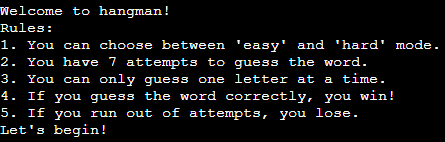

# Hangman Game!

## Overview

Welcome to Hangman! Hangman is a classic word guessing game where you try to guess a hidden word one letter at a time.
With each incorrect guess, a part of a hangman figure is drawn. The game provides options for easy or hard difficulty and tracks your wins and losses.

## Features

### Existing Features

- **Rules**: Quickly learn the rules of Hangman before you begin.
- **Name Entry**: Enter your name at the start to personalize the experience.
- **Game Modes**: Choose between 'easy' and 'hard' mode to set the difficulty level.
- **Gameplay**: Guess one letter at a time and try to uncover the hidden word.
- **Hangman Display**: A visual representation of a hangman figure builds each time you make an incorrect guess.
- **Win and Loss Tracking**: The game keeps track of your wins and losses.
- **Restart**: Quickly play another round after finishing a game.

## How to Play

1. Enter your name to start.
2. Select your preferred difficulty level: 'easy' or 'hard'.
3. A word from the chosen category will be randomly selected as the hidden word.
4. Guess the hidden word one letter at a time by entering your choice.
5. You have seven attempts to guess the word.
6. If you correctly guess all the letters in the word, you win. If you run out of attempts, you lose.
7. The game keeps track of your wins and losses, which you can see at the end of each round.

## Technologies Used

- Python
- Regex
- Heroku (for deployment)

## Testing

This game has been validated using [Python Syntax Checker PEP8](https://www.pythonchecker.com) and did not have any significant issues.

### Game Testing

The game has also been tested for while having human error in mind.

-No issues appear while using odd letters, symbols or numbers as input.
-The game is able to handle several inputs at once, and will deny them.
-Another round will only start if the user specificly says yes.

## Deployment

You can play the Hangman game by visiting the following link: [Hangman Game](https://hangman-game1-2a2cd8b9bd71.herokuapp.com)

- The game is deployed using Heroku.

The link to the GitHub repository can be found [here](https://github.com/Pontaaaa/hangman)

## Credits

* Quick access to information and understanding through [W3Schools](https://www.w3schools.com/python/python_conditions.asp)
* Finding out and understanding how to limit input for letters only from [StackOverflow](https://stackoverflow.com/questions/66629180/how-to-restrict-the-user-to-input-only-letters-and-numbers-in-python-3)
* Figure for the Hangman is from [Hangman ascii art and wordbank](https://gist.github.com/chrishorton/8510732aa9a80a03c829b09f12e20d9c)
* Template for the README was provided by [Code Institute (template)](https://github.com/Code-Institute-Solutions/readme-love-maths/blob/master/README.md?plain=1)

## Media

[Hangman ascii art and wordbank](https://gist.github.com/chrishorton/8510732aa9a80a03c829b09f12e20d9c)
Hangman figure and art is from chrishorton on GitHub.